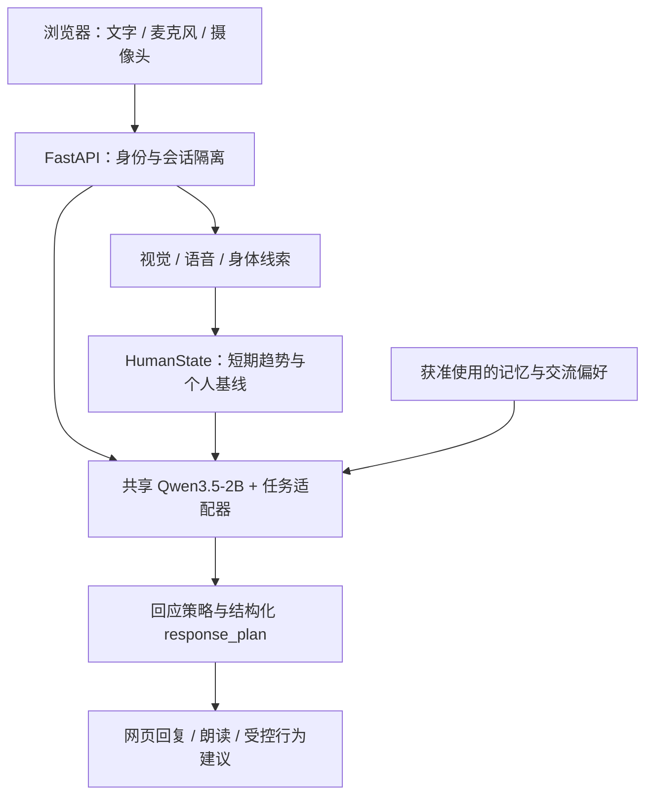

<div align="center">

# Anima

### 让陪伴有上下文，让记忆有边界。

面向中文居家场景的本地 AI 陪伴系统。<br>
连接对话、声音与视觉线索，在明确授权下记住偏好，提供持续的日常交流。

**本地推理 · 中文优先 · 多模态交互 · 可控记忆**

[快速开始](#快速开始) · [系统架构](#系统架构) · [开发与验证](#开发与验证) · [文档](#文档)

</div>

---

## 关于 Anima

Anima 将 Qwen3.5-2B 中文对话模型、轻量视觉与语音组件、成员记忆和陪护策略组合成一套可在本机运行的系统。你可以通过网页与它聊天、开启语音和摄像头、管理自己的记忆与偏好，也可以通过 API 为机器人控制器提供结构化的回应与行为建议。

项目关注对话的连续性：结合刚刚说过的话、当前可用的非语言线索，以及用户明确允许保留的信息，决定这一轮如何回应。用户的明确表达和边界始终优先。

> **项目状态：研究与工程验证阶段。** 当前应用为 V5.2 系列，主要在 Windows 本地环境验证。仓库提供源码与运行配置；模型权重、训练数据和个人数据库单独管理，克隆后需要完成环境与模型准备。

## 核心能力

| 能力 | 已实现内容 |
| :--- | :--- |
| **中文连续对话** | 共享 Qwen3.5-2B 主干与任务适配器，结合近期上下文、纠正信息和交流偏好组织回应。 |
| **语音交互** | 本地语音检测与识别、慢速停顿处理、有限轮次队列，以及浏览器回声消除条件下的打断处理。 |
| **视觉与身体线索** | 人脸检测、表情特征、轻量姿态和可选面部几何；摄像头由用户开启。 |
| **连续状态** | 将 Face、Voice、Body 线索组织为 `HumanState`，维护短期趋势和获准建立的个人基线。 |
| **成员与记忆** | 成员 PIN、会话隔离、加密长期记忆、偏好管理，以及事实修订、历史检索、纠正和删除。 |
| **日常陪护** | 提醒的到期、确认、延后与重复处理，请求重试与冲突校验；主动关怀默认关闭，支持安静时段与拒绝打扰。 |
| **机器人接入** | 输出结构化 `response_plan`，提供带独立密钥和心跳保护的控制器桥接协议。 |

视觉和声音输出是辅助线索，不能直接代表一个人的真实内心状态。当前没有真实家庭长期效果验证、临床验证或实体机器人动作验收；不提供医疗诊断、自动紧急拨号或经验证的跌倒检测。

2026-10-06 更新借鉴 Graphiti 的时序记忆、τ²-bench 的任务状态验证和 AgentDyn 的提示注入评估方向，改进记忆、提醒服务和对话数据边界。具体实现、复现方式及真实模型样例中的剩余不足见 [V5 更新说明](v5/README.md)。

## 快速开始

### 1. 获取源码

```powershell
git clone https://github.com/miracle121388-a11y/Anima.git
cd Anima
```

### 2. 准备 Python 环境

现有启动脚本使用项目内的 `.venv_zh`，本机验证环境为 Python 3.12。已有环境可跳过这一步。

```powershell
py -3.12 -m venv .venv_zh
.\.venv_zh\Scripts\python.exe -m pip install --upgrade pip
.\.venv_zh\Scripts\python.exe -m pip install -r v5/requirements.lock.txt --extra-index-url https://download.pytorch.org/whl/cu124
```

`requirements.lock.txt` 是现有环境的依赖快照，包含 CUDA 12.4 版 PyTorch。其他平台或纯 CPU 安装需适配依赖；本项目暂未提供跨平台的一键安装包。前端为静态 HTML、CSS 和 JavaScript，无需 Node.js 构建即可运行。

### 3. 准备模型资产

**源码仓库不包含完整运行权重。** 启动前需要将匹配的模型和配置放到以下位置：

| 路径 | 用途 |
| :--- | :--- |
| `v2/models/qwen35_2B/` | Qwen3.5-2B 本地主干与 tokenizer。 |
| `v2/models/social_zh/best/` | 原任务适配器与分类头。 |
| `v4/runs/current_state_lora/best/` | 当前状态适配器，与发布配置中的指纹绑定。 |
| `v4/runs/dialogue_repair_v2/best/` | 中文对话适配器，与发布配置中的校验值绑定。 |
| `v4/models/cpu_base_int8.pt` | CPU 量化后端使用的实验性共享底座。 |
| `v5/models/` | 视觉、语音、姿态、检索等模型及对应清单。 |

模型绑定以已提交的 [`v4/models/release.json`](v4/models/release.json) 为准，校准参数见 [`v2/reports/calibration.json`](v2/reports/calibration.json)。通用底座不能替代本项目训练的适配器；当前仓库未附这些适配器的公开下载包。

感知组件的准备脚本位于 [`v5/scripts/`](v5/scripts/)，包括 `download_models.py`、`download_embedding.py`、`download_social_encoders.py` 和 `download_speech_assets.py`。具体准备流程见[部署说明](v5/deliverables/社会情感升级部署说明.md)；正式服务不会在启动时自动补齐模型。

### 4. 启动服务

环境与模型准备完成后，在仓库根目录执行：

```powershell
.\start_v5.ps1 -Profile balanced
```

打开 **[http://127.0.0.1:8768](http://127.0.0.1:8768)**，按页面引导选择成员或访客，再按需开启长期记忆、麦克风与摄像头。

```powershell
# 显式选择 CPU 或 GPU
.\start_cpu.ps1
.\start_gpu.ps1

# 固定普通话识别；默认 auto
.\start_v5.ps1 -Profile balanced -SpeechLanguage zh

# 停止本地服务
.\stop_v5.ps1
```

服务默认绑定本机地址。接口文档位于 [`/docs`](http://127.0.0.1:8768/docs)，运行状态位于 [`/health`](http://127.0.0.1:8768/health)。向非本机地址提供服务前，启动脚本要求设置 `SOCIAL_API_TOKEN`。

### 运行档位

| 档位 | 语音识别 | 感知配置 |
| :--- | :--- | :--- |
| `ultra_light` | Whisper base INT8 | 基础视觉与轻量姿态，较低采样频率。 |
| `balanced` | SenseVoiceSmall INT8 | 增加面部几何，使用中等采样频率。 |
| `best_edge` | SenseVoiceSmall INT8 | 保留完整感知配置，提高采样频率。 |

默认 `auto` 在内存至少 12 GiB、逻辑 CPU 至少 8 个时选择 `balanced`，否则选择 `ultra_light`。这是档位选择规则，并非最低硬件要求。每次只启用一个语音识别后端；感知组件使用 CPU，Qwen 根据设备配置使用 CPU 或 CUDA。

## 系统架构



视觉、身体和音频使用有界工作通道，繁忙时拒绝额外请求，避免积压过期帧。Qwen 在用户轮次或声音事件到达时运行，不在每帧感知时重复调用。行为建议进入控制器授权流程；对话内容本身不能授予设备执行权限。

### 隐私与用户控制

- 长期记忆需要用户许可，支持撤回、清空和删除成员；当前会话与持久记忆分别管理。
- 个人记忆采用加密存储，本机密钥使用 Windows DPAPI 保护；原始视频与音频不长期保存。
- 人脸登记需要本人同意，人脸候选匹配不能解锁私人记忆，也不替代 PIN 登录。
- 核心推理在本地运行；可选在线朗读或外部服务另有网络依赖，不能将所有使用方式描述为完全离线。

## 开发与验证

```text
Anima/
├── v5/
│   ├── social_v5/           当前应用与多模态、记忆、陪护逻辑
│   ├── web/                 无构建步骤的网页界面
│   ├── scripts/             模型准备、评估与验证工具
│   ├── tests/               Python 与语音前端测试
│   └── deliverables/        部署、接入与验证文档
├── v4/social_v4/             共享推理、对话与响应检查
├── v2/social_world_zh/       模型、策略、数据结构与记忆基础
├── start_v5.ps1              主启动入口
└── stop_v5.ps1               停止服务
```

`v2`、`v4` 是 V5 当前仍在使用的依赖模块，目录名称沿用开发历史。虚拟环境、模型、训练数据、运行数据库、生成报告与旧版归档通过 `.gitignore` 排除出提交。

运行各 Python 测试套件时使用独立进程，避免历史同名测试模块冲突：

```powershell
.\.venv_zh\Scripts\python.exe v5/scripts/verify_upgrade_regression.py

# 仅运行当前应用测试
.\.venv_zh\Scripts\python.exe -m pytest v5/tests -q

# 语音前端测试，需要 Node.js
node --test v5/tests/test_turn_detector.cjs v5/tests/test_voice_queue.cjs
```

2026-10-06 本机回归结果：**215 项 Python 测试（V2 33、V4 29、V5 153）、2 项语音前端测试通过**。V5 最终全量复测耗时约 71 秒；首次全套执行在视觉集成检查附近停滞并中止，复测未复现。真实对话另测四个合成样例，质量结果及不足见 V5 更新说明。这些测试覆盖程序行为与约束，不等同于真实家庭场景下的识别准确率或陪伴效果评估。

欢迎通过 [Issues](https://github.com/miracle121388-a11y/Anima/issues) 提交问题或讨论改进。复现信息请包含运行档位、CPU/GPU、依赖版本和必要日志；提交代码时附上相关验证结果，避免包含个人记忆、密钥或原始用户媒体。

## 文档

| 文档 | 内容 |
| :--- | :--- |
| [V5 详细说明](v5/README.md) | 功能说明、配置与开发记录。 |
| [部署与接口](v5/deliverables/社会情感升级部署说明.md) | 环境、模型、数据流与 API。 |
| [表情与连续对话](v5/deliverables/表情与连续对话升级说明.md) | 面部几何、上下文和回应策略。 |
| [居家陪护接入](v5/deliverables/居家陪护接入说明.md) | 提醒、主动关怀与机器人桥接协议。 |
| [社会情感升级验收](v5/deliverables/社会情感升级验收报告.md) | 实测范围、结果与限制。 |
| [第三方组件说明](v5/THIRD_PARTY_NOTICES.md) | 模型、组件与数据来源。 |

历史文档中的部分报告和模型链接指向本地工件，不随源码仓库发布。

## 许可证与第三方组件

当前仓库尚未提供项目级 `LICENSE`，也未声明统一的开源许可证。第三方代码、模型与数据遵循各自的许可说明，详见 [V2](v2/THIRD_PARTY_NOTICES.md)、[V4](v4/THIRD_PARTY_NOTICES.md) 和 [V5](v5/THIRD_PARTY_NOTICES.md) 的来源清单。
