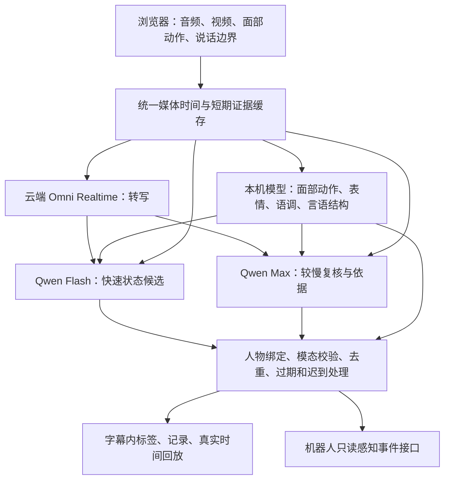

# Anima：实时多模态人的状态感知

**给接手同事的项目说明与优化交接。更新：2026 年 10 月 8 日。**

Anima 当前重点是 **Perceive（感知）**：持续观察一个人，结合他说了什么、说话方式、表情和眼前画面，估计他此刻的状态，把变化及时显示出来，并保留判断依据。

它不是只做字幕，也不是给一整段视频写一篇情绪分析。我们要的是：**人在表达过程中，字幕和有依据的标签就能出现；状态变了，标签也跟着变。**

> **当前阶段：已有可运行的科研 Demo，仍需优化识别效果。没有证据宣称已全面达到 Interhuman。** 五个参考案例的快速请求速度已有明显改善，真实页面可边观察边分析、录制、回放；细粒度识别、误报漏报、中文表现和最终长测仍需继续验证。请先读“已知问题”和“接下来怎么做”，不要从头重搭，也不要把历史方案当成已完成能力。

## 先找到正确的项目

这个仓库同时保留两条代码线：

| 位置 | 是什么 | 本次接手是否重点 |
| --- | --- | --- |
| [`perceive/`](perceive/) | 本轮新做的实时感知 Demo：浏览器 + Node.js + 本机 Python 模型 + 云模型 | **是，优化效果主要改这里** |
| `v5/`、`v4/`、`v2/` | 原 Anima 陪伴系统：中文对话、身份与记忆、声音/视觉、陪护与机器人接口 | 保留；不要为优化 Demo 随意删除或改造 |
| [`README.legacy-v5.md`](README.legacy-v5.md) | 原项目运行方式和功能说明 | 需要运行原 V5 时再读 |
| [`docs/history/`](docs/history/) | 对话过程中形成的原始调研、产品方案和界面方案 | 用来理解决策演变；冲突时以本 README 的当前约定为准 |

原来的另一个项目是 [robot-brain-dashboard](https://github.com/hhz-1019/robot-brain-dashboard)。它提供了浏览器采集、模型桥接、机器人状态看板等工程参考。本次提交不把它整个复制进 Anima，也没有修改它的业务。

## 1. 我们到底想做什么

项目长期方向是社会智能，分成四步：

| 步骤 | 回答什么问题 | 例子 |
| --- | --- | --- |
| **Perceive** | 这个人此刻表现出什么，刚刚有什么变化？ | “说到第二点时明确表示不确定，并反复改口。” |
| **Understand** | 联系这个人的历史，怎样理解这次表现？ | “他平时也会慢慢组织语言，这次是否与以往不同？” |
| **Predict** | 接下来可能发生什么？ | 预测下一步状态或行为变化 |
| **Engage** | 机器应该怎样参与？ | 回应、提问、安慰或执行动作 |

**这次只把 Perceive 做好。** 它可以理解当前话语、画面含义、指代、否定、引用和刚才的上下文；也可以进一步判断当前状态，不是只复述“看见他笑了”。但它不查询这个人的历史画像、过去聊天、MBTI、长期习惯或个人基线。

“理解当前一句话”发生在 Perceive 中；“结合这个人的个人历史理解原因”留给 Understand。这是本项目的工程划分，不宣称是行业统一定义。

### 已经对齐的产品取舍

- **第一版观察一个人**。多人关系、团队氛围、人机共同互动是后续方向，机器现在主要负责观察。
- **不绑定养老、餐厅、销售等行业场景**。先把“人的当前状态感知”本身做好。
- 语意和画面意义是基础，声音韵律、面部动作与表达变化是真正的补充证据。不能只给文字分类，再说已经做了多模态。
- 身体只做基础画面理解，不先做完整的肢体情绪分类器。
- 要有完整可用的感知链路，同时把识别细微差异、发现短暂变化作为长板；不靠增加几十个未经验证的标签显得全面。
- 用户重视三点：**更快、更细、更准**。标签更多不等于更准，字幕快也不等于状态判断快。
- 当前为科研研究。优先整合开源预训练模型与已有 API；**暂不自训练，不接 Interhuman API，不新增付费资源采购**。以后有更大设备也可以用，不把这台笔记本的显存当作永久能力上限。
- 用户希望优先消耗其已有免费模型额度；“每个模型有一百万 token”是账号当时的额度信息，不是代码能保证的固定福利。余额、有效期、开通权限以实际账号为准。
- **只保留一个极简页面，名字仍叫 Anima。** 早期的左右双栏、大量文字、四类大卡片、多个页面已经放弃。
- 不设置定时优化任务。此前定时任务已删除，实验应由开发者明确启动。

### 不再沿用的早期定义

早期曾提出“表达进程、犹豫不确定、澄清线索、立场、参与变化”五个顶层类别，用户认为层级不合理，已经否决。澄清是表达行为，不应与情绪、认知状态平起平坐。早期 20 标签方案也不是当前已经验证的 20 项能力。

“识别撒谎”曾作为用户希望探索的例子，但没有成为已实现功能。不能从紧张、视线或表情推出故意欺骗；当前不输出“此人在撒谎”。严格意义上的微表情识别也未实现，面部动作单元不等于读出了隐藏情绪。

## 2. 为什么参考 Interhuman，参考到什么程度

Interhuman Inter-2 公开的十个社会信号不全是情绪，还包括确信、犹豫、困惑、兴趣、赞同等。因此我们的目标也不是另做一个普通“七种表情分类器”。参考的是：**当前状态 + 时间定位 + 依据 + 流式事件 + 简洁呈现**。

相关来源：[官网 Demo](https://www.interhuman.ai/)、[Inter-2 研究说明](https://www.interhuman.ai/blog/how-we-trained-inter-2)、[社会信号定义](https://docs.interhuman.ai/explanations/social-signals)。研究快照和对照记录在 [`perceive/research/`](perceive/research/)。

官网参考人物是 Yann LeCun、Steve Jobs、Elon Musk、Pep Guardiola、Mark Zuckerberg。已检查的是官网默认 Inter-2 的展示案例；**没有调用它的 API**。

请牢记三点：

1. 官网案例中的标签是网页提供的预录事件，不是我们测出的 Interhuman 在线推理时延。
2. 用户后来明确：**不要求我们的标签与它逐项一致**。旧的参考覆盖率和时间重合率只作诊断，不再作为完成标准。
3. 这五个片段反复用于调试，已经是开发集，不能再称为独立留出集。不得在提示词或推理代码里写入人物、片段、参考答案，也不能结束后补标签冒充当时就识别到了。

用户曾询问 Interhuman 价格、模型大小和自训练条件。当前没有把其 API 采购或自训练纳入实现，也没有足够依据给出“照此规模就能训练到同等效果”的配置保证。不要把估计参数量、不同任务的榜单分数或宣传中的延迟，当成可复现结论。

## 3. 当前识别什么

内部仍按情绪、认知、投入、立场组织；界面把具体标签放在同一个层级。当前社会状态候选如下：

| 标签 | 想判断的内容 | 不能直接等同于 |
| --- | --- | --- |
| 赞同 | 对当前观点、提议或理解表示认可 | 微笑、礼貌回应 |
| 反对 | 明确拒绝或挑战一个观点、提议 | 讨厌这个人 |
| 怀疑 | 对说法的可信度有所质疑 | 任何疑问句 |
| 表达自信 | 表达坚定、有把握 | 内容一定正确、人格自信 |
| 犹豫 | 表达承诺受阻、反复搜索词语或修正 | 一个“嗯”、正常停顿 |
| 挫败 | 对受阻或不满意结果表现出烦躁、受挫 | 仅仅描述过去的失败 |
| 兴趣 | 对当前对象表现出探索意愿或好奇 | 随口问“你在测试是吧” |
| 不确定 | 对自己的知识、判断或决定没有把握 | 只是找词 |
| 困惑 | 对正在讨论的内容存在理解困难 | 没听清、请求重复 |
| 压力 | 当前可观察的紧绷或负荷表现 | 医学诊断、长期心理特征 |

另外有 **7 种表情候选**（愉悦、低落、惊讶、害怕、厌恶、生气、轻蔑）和 **6 种语调候选**（前六项），显示时明确加“表情 / 语调”。共 23 个展示候选，不代表 23 项都已达到同样效果。唯一目录在 [`signal-catalog.js`](perceive/public/signal-catalog.js)。

允许多个标签同时成立，例如表达自信同时反对某观点。它们不是一个总和必须为 100% 的情绪饼图。没有足够证据就不显示；不强行填“平静”“中性”。

当前标签还存在差异：快速通道先给候选，依据说明较概括；复核通道可给具体线索，但更慢。通用融合模型仍承担社会状态判断，专用模型主要提供辅助证据，**并没有训练出 Anima 自己的社会状态基础模型**。

## 4. 一个页面怎么用

页面是米白背景、Anima 字标、一块大视频、实时字幕与短标签、底部胶囊案例条和“试试自己”。标签点击后才展开依据；记录按需打开，不常驻一堆分析文字。

- **首页五案例**：目前沿用早期模型的离线分析结果，页面已标明“模型离线分析”。不是当前候选实时跑出的答案，也不是 Interhuman 原标签。旧结果可能还有旧标签名，后续应重新整理。
- **试试自己**：设置 Key，点击“开始实时观察”，授权摄像头与麦克风后持续分析。
- **观察期间**：字幕、表情/语调、快速状态分别更新，不等录制结束。只有新出现的词加入动画，已有词不应整句闪烁。
- **结束实验**：停止设备与云连接，保留本次录制和结果，按真实到达时间回放。
- **记录 / 点击标签**：查看时间、来源、依据和初步结果；晚到的判断可以留档，但不能贴回当下画面。
- **保存实验**：导出视频与事件 JSON。普通实验仅在浏览器内存中，刷新或关闭页面会丢失，重要实验先保存。
- **选择视频**：离线分析上传短片，先转写声音再融合。它是回看功能，不能拿其效果冒充实时。

实时录制上限为 **10 分钟 / 128 MiB**；上传入口是 **2 分钟 / 32 MB**。这是两个不同限制。

## 5. 实际架构：不是只接一个语言模型



| 模块 | 当前选择 | 实际输入与用途 |
| --- | --- | --- |
| 实时转写 | `qwen3.8-omni-flash-realtime` | 接原始音频；确认文字与可修改草稿分开处理 |
| 快速判断 | `qwen3.7-flash` | 最后两帧、确认转写、本地测量，输出紧凑的十类状态候选 |
| 复核判断 | `qwen3.8-max` | 时序图片、当前转写、短期语意与本机证据，输出状态、时间和解释 |
| 面部 | OpenFace 3.0 + EmotiEffLib `enet_b2_8` | 找脸、8 个动作单元、视线及表情分类 |
| 声音情绪 | emotion2vec-plus-large | 原始声音，9 类未校准分类分数 |
| 言语结构 | Romana WavLM，约 94.4M 参数 | 原始声音，填充停顿、重复、修正、重启、部分词；主要是英语训练 |
| 浏览器观察 | MediaPipe + Silero VAD | 面部动作、人物存在、说话开始/停止 |
| 基础测量 | 本机 DSP | 音量、削波、粗略基频、停顿等 |
| 本地 ASR 备选 | SenseVoiceSmall | 云转写不可用时的显式备选；长窗口重复计算有延迟问题 |

**Flash 和 Max 没有收到原始声音。** 它们收到转写和本机声音模型的摘要，因此只能解释这些声音证据，不能写成“融合大模型直接听出了语气”。专用声音模型确实分析了原声，这与“完全只看语意”也不同。

原始方案希望强音视频模型直接接收全部模态；当前默认实现是为实时性、可用性与实际调用结果作出的取舍。以后值得用原生音视频强模型做同条件对照，但不能只换模型名称就宣称解决了问题。

### 时间与调度

- 音频重采样到 16 kHz PCM，约每 100ms 传输；ASR 约 2 秒提交一次，VAD 边界可促成提交。
- 图片每 0.5 秒更新；浏览器面部处理约每秒 5 次，忙时跳过。
- 当前状态以约 3 秒滚动窗口为主；语意只保留本次会话最近 45 秒。
- 快速调度每 0.5 秒尝试、最多 1 个进行中请求；**尝试频率不等于答案频率**。
- 复核默认每 2 秒尝试，最多 2 个并发；不同实验轮次的参数可能不同。
- 快速和复核的“当前”期限为 2 秒；面部 / 言语结构约 1.5 秒，声音标签约 3 秒。超过期限只存历史，不通过延长显示来伪装低延迟。
- ASR 草稿可先在页面显示，但只有确认部分进入状态判断；找不到精确提交时间的草稿标为 `receipt-estimate`，不纳入可靠延迟统计。
- 短暂网络或格式问题在新输入上恢复；权限、无额度等错误明确停止对应云通道，其余可用分析继续。页面显示“部分分析”，不能假装完整运行。

## 6. 如何运行

### 环境

本轮实测设备是 **MacBook Air M5、16 GiB 内存、1 TB 存储**。用户最初的“10+1t”不能解释成 10 GB 显存。Node.js 22.23.2，Python 3.12；项目要求 Node.js ≥22.19，本机安装器支持 Python 3.11 / 3.12。

当前专用模型跑 CPU；实际 Torch 线程设为 1。曾发现 FunASR 在构造时把线程数覆盖成 4，已经修复并在状态接口报告实际值。不要只看环境变量就以为实验真控制住了线程。

安装脚本按 macOS / Unix 虚拟环境路径实现。Windows 请适配路径，**原 V5 的 Windows/CUDA 依赖锁不适用于这里**。

```sh
git clone https://github.com/elsewhere-high/Anima.git
cd Anima/perceive
npm ci
npm run setup
npm run setup:models
npm start
```

打开 **http://127.0.0.1:4827/**。也可双击 `perceive/启动 Anima.command`。

`npm run setup` 下载公开参考视频、浏览器模型并准备浏览器依赖；`setup:models` 安装 Python 环境和基础面部/声音权重。**Romana 言语结构模型及可选 SenseVoice 不在基础安装器中**，见 [`perceive/README.md`](perceive/README.md) 的补充准备说明。缺失模块会降级，并不代表完整配置已复现。

在“试试自己 → 模型设置”填自己的阿里云千问 Key，分别选择快速判断和复核模型。默认选择上表两个模型；如果账号或地域不支持，先检查权限，再通过同一批实际图片/声音请求评测备选。图片生成、视频生成模型不是本项目的感知模型。

默认地址是千问官方兼容接口。业务空间专用地址在“调用地址”填入；不要复制其他人的空间地址。Key 由服务仅在内存保存，服务重启后重新填，不写入 Git。

```sh
# 若默认端口已被其他程序占用
PORT=4832 npm start

# 显式选择本地 ASR；需先准备 SenseVoice 权重
ANIMA_LOCAL_ASR=1 npm start
```

`npm start` 发现同端口已有 Anima 时会复用并提示地址，**不会热更新旧服务**。修改后先保存重要录制，明确停止自己的旧进程再重启。

### 交接时原电脑上的运行状态

- `4827` 仍是较早启动的用户服务，未被当成最终新版自动替换。
- `4831` 是研究候选。最近一次启动早于“上传时用本地人脸结果修正人物存在”的最后小补丁。
- 本次提交的是磁盘上的最新代码，不意味着原浏览器与服务内存已升级。接手后应从新进程确认实际版本。
- 为保留用户已有录制，交接过程不强行刷新旧页面。

## 7. 代码从哪里读、效果从哪里改

所有下列路径相对 `perceive/`：

| 文件 / 目录 | 职责 | 典型修改 |
| --- | --- | --- |
| `launch.mjs`、`perception-runtime.mjs` | 正式启动与默认模型调度 | 默认配置、线程、窗口、云/本地转写 |
| `server.mjs` | HTTP、配置、离线上传、状态接口 | 上传转写、人物有效性、接口校验 |
| `realtime.mjs` | 持续音视频输入、多路调度与事件 | 速度、重试、丢弃过期结果、通道故障 |
| `evidence.mjs` | 音画缓存、确认字幕、短期上下文 | 时间对齐、证据缺失、上下文泄漏 |
| `specialist-social.mjs`、`social.mjs` | 快速/复核提示词、返回解析与证据校验 | 状态定义、融合方式、误报漏报 |
| `model-policy.mjs`、`qwen.mjs` | 模型选择、用量、千问连接与转写 | 可调用模型、错误分类、字幕适配 |
| `integrations/specialists.py`、`specialists.mjs` | Python 模型进程与 Node 桥接 | 本机推理、线程、超时与质量 |
| `integrations/disfluency.py`、`speech-delivery.mjs` | 言语结构模型与谨慎映射 | 重复/卡顿线索，英语到中文迁移 |
| `state-engine.mjs` | 出现、更新、结束、过期和撤回 | 标签抖动、重复、旧状态残留 |
| `public/app.js`、`live-state.js`、`live.js` | 单页、字幕、录制、回放、实时连接 | 新词动画、显示时机、完整录制 |
| `public/face-worker.js`、`pcm.js`、`media.js` | 浏览器采集与处理 | 采样时钟、帧率、音视频对齐 |
| `public/signal-catalog.js` | 当前 23 项展示候选 | 让前后端目录一致 |
| `public/case-results.js` | 旧离线案例结果 | 不参与实时推理，不当作新版本效果证明 |
| `research/candidate-server.mjs` | 隔离候选服务 | 不打断用户实验的参数比较 |
| `research/iteration-status.json` | 轮次、决定、未完成项 | 接着上一轮工作，避免重复踩坑 |
| `tests/` | 工程回归检查 | 约束、流式行为、恢复和回放 |

`native-social.mjs`、`rotating-session.mjs`、`fusion-provider.mjs` 等保留试验路径。文件存在不代表默认启用。历史 Gemini 适配与旧 20 标签规范也还在，默认当前路径以 `launch.mjs` 为准。

## 8. 已做过的实验，哪些结论可靠

以下只报告可回溯的测量，不把标签数当准确率。P50 是中位数，P95 表示约 95% 样本不超过该值。

| 实验 | 结果 | 如何理解 |
| --- | --- | --- |
| 第 32 轮：五个官网案例各 3 遍，共 15 场 | 67 个播放中快速结果；请求 P50 **922ms**、P95 **1805ms**；输入窗口结束至收到 P50 996ms、P95 1822ms；2 次格式异常后恢复 | 该轮速度接近内部目标，不是泛化准确率 |
| 第 32 轮：空白、静音、无画面各 2 场 | 空白与无画面没有显示状态；静音判断没有引用缺失的声音/文字 | 只说明这 6 场控制通过，静音下的视觉状态仍需人工判断正确性 |
| 第 33 轮：真实页面 20 秒 | 127 次字幕更新、91 次本机测量、16 次快速结果、7 次播放中复核；无异常；录制 20.022 秒，完整链路检查为 true | 更新次数不是句子数；确认了页面、录制与回放集成 |
| 同一 20 秒页面测试 | 快速请求 P50 **1067ms**、P95 **1915ms**；快速标签首次 DOM 显示 P50 **992.5ms**、P95 **1408.2ms** | DOM 与请求统计使用不同样本子集，不能直接相减解释 |
| 第 31 轮：连续 600 秒真实页面 | 录制 600.0245 秒；30/30 空白静音检查无残留标签；504 个播放中快速请求 P50 **969.5ms**、P95 **1813ms** | 最后约 599.9 秒时快速模型因额度拒绝，**完整多模态验收为 false**，不能写成长测全通过 |
| 第 33 轮：6 个 CREMA-D 新人物中性片段 | 没有显示非中性表情/语调；各片段声音平均首类为中性；2 例显示“表达自信”或“不确定” | 没有社会状态人工真值，不能宣称这两个标签对或错；面部原始平均首类 5/6 并非中性，仍需研究 |
| 工程测试 | 完整套件 93 项通过；最后上传人物归属修补的针对性测试通过 | 模拟接口验证程序行为，不证明模型准确率；本次交接在未安装视频素材的干净依赖环境中再次跑完整套件，93/93通过 |

主要证据：

- [第 32 轮汇总](perceive/research/iterations/32-current-evidence/summary.json)、[原始事件](perceive/research/iterations/32-current-evidence/live.json)、[控制实验](perceive/research/iterations/32-current-evidence/controls.json)。
- [20 秒实际页面](perceive/research/iterations/33-product-integration/actual-ui20.json)、[上传真实调用](perceive/research/iterations/33-product-integration/upload-real.json)、[新人物检查](perceive/research/iterations/33-product-integration/neutral-summary.json)。
- [600 秒长测](perceive/research/iterations/31-continuous/application-summary.json)、[真实图片额度检查](perceive/research/iterations/31-continuous/image-access-after-long-run.json)。
- [全部轮次决定](perceive/research/iteration-status.json)、[研究说明及上游证据](perceive/research/README.md)。

### “实时”到底怎样测

至少区分四个时间：

1. **表达/证据出现时间**：真实声音或动作发生在哪一刻；需要人工事件标注才能可靠得到。
2. **输入窗口结束时间**：这一批音画最后一刻，音频按采样位置计时。
3. **服务返回时间**：模型结果何时真正收到。
4. **页面显示时间**：用户屏幕上何时首次出现对应字幕或标签。

本项目同时记录请求耗时、输入结束到收到、输入结束到 DOM。约 2 秒的 ASR 音频采集等待不包含在“提交后 300ms 返回”里。没有精确时间的草稿不能用接收时刻减自身估计时刻，算出好看的伪低延迟。采样 20ms、刷新 100ms 都不能宣传成 20ms / 100ms 社会感知延迟。

只使用当时已经到达的输入，区分播放中结果与 `afterStop`，迟到结果保留而不回填。这些比标签是否与官网恰好一样更重要。

## 9. 已知问题：接手后不要跳过

1. **准确性仍未被独立验证。** 目前没有覆盖主要状态、多人群与中文自然表达的人工标注集，也没有证明相对通用模型的优势。
2. **复杂判断仍靠通用模型。** Flash/Max 可能被语意带偏，局部声学分类也可能错。融合不等于各模态都正确贡献了信息。
3. **颗粒度仍有上限。** 约 3 秒窗口、抽帧及每窗最多 4 条模型信号，可能漏掉短暂表情/态度变化；不是严格微表情模型。
4. **复核慢，很多结果已经过时。** 32 轮播放中 26 个复核结果有 17 个过期。把它们隐藏出当前标签是正确处理，但没有解决复核本身的速度和价值问题。
5. **快速标签的具体依据较弱。** 紧凑输出节约时间，却省略细节；有些标签一直停留在待确认状态。不能用更自信的文案掩盖证据不足。
6. **识别与显示稳定性要一起测。** 阈值、去抖、持续确认可能减少乱跳，也可能增加漏检和延迟。当前阈值没有经过目标人群校准。
7. **中文与自然交流证据少。** Romana 主要训练于英语电话语音；普通停顿、口音、说话习惯不应自动变成犹豫。CREMA-D 是表演数据，并不覆盖全部自然场景。
8. **人物和声音绑定仍可能错。** 无画面控制已有保护，不等于已解决画外音、多人同框、画面切换和重叠说话。
9. **最终配置的 10 分钟完整复测待做。** 旧长测最后额度不足，之后又改过当前状态期限与字幕时间规则，不能沿用旧结果宣布新配置完成。
10. **云接口权限与额度可能突变。** 曾发生小文本请求成功、真实图片请求却 `insufficient_quota`。探活必须用实际模态，不能只请求一个“OK”。
11. **本机部署还有交接缺口。** 大模型完整音视频推理不适合这台 16GB Air；基础安装器不自动准备全部研究模型与研究视频。复制源码不能代替模型准备。
12. **首页离线案例需要与新版本统一。** 目前它保留旧模型结果与旧标签；必须标清来源，重新生成时保留版本和时间，不手工抄官网答案。
13. **离线上传刚补齐转写。** 已有真实音频转写成功记录；最后基于本地找脸更新人物归属的补丁还需重启后实际复核。
14. **最终发布尚未完成验收。** 源码已可交接，不代表原电脑 4827 运行进程升级了，也不代表整体能力已经媲美 Interhuman。

## 10. 哪些路试过，为什么保留或放弃

| 路线 | 已有结果 | 接手建议 |
| --- | --- | --- |
| 单个通用 Omni 做全部判断 | 初期字幕尚可，状态判断慢、漏细节，用户体验不满意 | 保留对照，不退回“只接一个模型就完事” |
| 原生持续/轮换 Socket 判断 | 有轮次请求更快，但覆盖与格式不稳定 | 代码保留；需要同协议重复验证才考虑替换 |
| 拆“表达方式 / 态度”两个判断 | 有短期改善，重复效果不稳定，请求变多 | 不当作已定最优解 |
| 紧凑数字输出 | 快速结果更短，但出现单条数组被展平、对象/数组不一致等格式问题 | 已兼容完整等价表示；不能为通过解析凭空补字段 |
| Flash / 27B / Max 比较 | Flash 更快；27B 在这批测试中多数为空；Max 结果较丰富但更慢 | 现在 Flash 快判 + Max 复核；输出多寡不是准确率 |
| SenseVoice 本地转写 | 能运行，长句重复窗口计算拖慢结尾 | 明确备选；默认恢复云转写 |
| MiniCPM-o 4.5，9B 量化 Mac 路线 | 已编译 Metal 引擎并跑真实权重；3 秒音画前缀约 12 秒推理，未输出有效信号 | 这台机器不适合作为实时主路径；更大设备可重测 |
| AffectGPT | 情感专项基准相关，官方流程依赖 CUDA | 值得独立对照，当前没有部署，不能写成已整合 |
| CrisperWhisper2 Small | 本机词级时间实验约 1.46 秒中位耗时，仍有截断/幻觉 | 不放在同步快速路径，可用于离线转写对照 |
| openSMILE eGeMAPS | 本地测量已运行，未进入默认链路 | 声学证据候选，不是心理分类器 |
| Nano-EmoX | 研究适配、权重准备与探测记录保留 | 不属于当前默认已验收功能，先读实际探测记录 |

挑模型时先问“它测的是不是我们的任务、用的是不是同一权重、能不能按这个实时预算工作”。例如 EmotiEffLib 的 AffectNet 基本情绪成绩、emotion2vec 的 IEMOCAP 结果、AffectGPT 的 MER-UniBench 汇总分，不能直接互比，更不能换算成 Anima 十标签准确率。

其他产品调研中，Hume / audEERING 主要借鉴声音表达和质量控制；MorphCast / FaceReader / Affectiva 借鉴面部测量与科研回看；Gemini / Qwen 借鉴通用音视频接口。没有对这些产品做可复现的同输入排名。更完整来源见[历史调研](docs/history/Perceive确定版方案与完整调研.md)和[本轮模型依据](perceive/research/README.md)。

## 11. 同事接手后的推荐顺序

**先复现，再找错例，再改一件事，再重复验证。** 不建议一上来堆新模型、改所有标签或重做 UI。

### 第一步：跑通当前提交

检查 Key 的真实音频/图片权限，确认状态接口中 face / voice / speech 的实际就绪情况与线程数，运行工程测试和 20 秒页面验证。复核上传转写与人脸归属。保存当前配置、原始事件、代码提交号和可回退版本。

### 第二步：建立能判断“更准、更细”的数据

保留官网五例作开发参考；补充不同人物的中文与中英混合自然片段、短暂状态变化、普通中性表达及容易误判的负例。优先覆盖：

- 普通问句被误当兴趣；微笑被当赞同；低头看材料被当走神。
- 正常停顿、找词与知识不确定的区别；流畅但不确定、平静但反对。
- 引用别人、叙述过去、假设场景和否定句；当前状态与旧话题不能混淆。
- 静音、无脸、遮挡、多人、画外音、网络短断。

请至少两人独立标注关键事件和依据，分歧保留。以人/片段划分开发与留出，不把同一人物同一段的相邻窗口拆进两边。六个中性片段已被查看，不能再当成从未接触过的留出材料。

### 第三步：先解决实测最大的误差来源

从错例决定是 ASR 丢词、视觉漏脸、声音分类不稳、融合被语意带偏、时间错位，还是显示过期。每轮只改一个主要变量，例如窗口长度、采样、声学表示、快速分类输出或复核触发方式。用相同输入比较并记录正反效果。

有更大算力时，可独立跑 AffectGPT、Qwen Omni 开放权重、MiniCPM-o 或强音频模型作对照；先离线确定真的改善哪些错例，再考虑进实时链路。不要用大模型给自己的输出打分作为唯一准确率证据。

### 第四步：复测整条链路并决定是否接受

五案例至少重复三次；跑空白/静音/无画面控制、新人物检查、中文样本与 10 分钟实际页面连续实验。报告延迟、漏检、多报、事件起止偏差、标签闪烁/残留、恢复情况及 token 用量。

内部快速请求参考目标是 **P50 ≤1 秒、P95 ≤2 秒**，不是 Interhuman 官方 SLA，也不替代实际页面和证据到达时延。单轮超过或达到都要看重复波动。完整链路的所有必要模块应持续可用；资源不足、模型缺失和结束后回填不能算通过。

当这些工程门槛可复现、主要误报有明确约束、关键难例通过独立审查，且用户认可展示效果时，停止为本版扩大范围。没有人工真值时，只能宣布工程链路验收，不宣布“准确率已全面超过某产品”。

## 12. 验证入口和日常开发

从 `perceive/` 执行：

```sh
npm test

# 隔离研究服务，使用已下载的本机模型；Key 仍在页面填写
ANIMA_TORCH_THREADS=1 ANIMA_VISUAL_FUSION=1 ANIMA_REVIEW_HOP=2 \
ANIMA_LOCAL_FAST=1 ANIMA_LOCAL_SPARSE=1 ANIMA_FAST_FRAMES=2 \
ANIMA_SPEECH_FAST=1 ANIMA_DISFLUENCY=1 PORT=4831 node research/candidate-server.mjs
```

先在 `http://127.0.0.1:4831/` 配置模型，再打开下列页面并点击运行。**真实调用会使用账号额度；不要同时跑多组性能测试。**

| 页面 | 用途 |
| --- | --- |
| `/iteration-qa.html?variant=my-test&presence=detector&rounds=3` | 五案例，各三遍，按实际时钟输入 |
| 上述地址加 `&control=blank`、`&control=mute` 或 `&control=no-video` | 缺失输入对照；可加 `&clips=yann-lecun-wef` 缩小范围 |
| `/iteration-qa.html?variant=my-neutral&presence=detector&suite=cremad-neutral` | 六个固定中性片段；先准备研究素材 |
| `/?qa=public-stream&seconds=20&profile=my-build` | 真正的页面、字幕、录制和回放路径；不访问实体摄像头/麦克风 |
| `/?qa=public-stream&seconds=600&profile=my-build-long` | 10 分钟压力测试；每分钟插入 5 秒黑画面静音，先准备长视频 |

```sh
python3 research/summarize-candidate.py my-test iterations/my-test
python3 research/summarize-app-profile.py my-build iterations/my-build/application-summary.json
node research/summarize-neutral.mjs INPUT.json OUTPUT.json
```

研究素材准备见 [`perceive/README.md`](perceive/README.md)。`research/autosaved` 按完成片段保存，别因浏览器页面关闭就盲目重跑。每轮给唯一 variant / profile，先读状态、最新记录和当前是否有运行中的测试。旧汇总器的口径可能不同，新实验优先使用上面两个脚本。

研究目录保留公开素材的文字/事件记录、摘要与当时的模型名；不提交私人录像、原始模型权重、安装环境或重复的回退源码快照。历史文件可能有原电脑路径和过时参数，仅用于追溯，当前相对路径和配置以本 README 为准。

## 13. 与原 Anima、机器人大脑、后续机器人怎么衔接

原 V5 已包含对话、语音、面部/身体观察、HumanState、成员隔离、长期记忆、提醒、陪护和机器人桥接；部分原模型资产不在仓库，详见旧说明。本轮参考其声音测量、动作与短期状态设计，并重新实现适合连续流的独立服务。

保留和借鉴：采集、声音特征、面部动作、质量判断、短期时序、模型调用与事件协议。暂不带入 Perceive：长期记忆、个人画像、成员识别、MBTI、TTS、自动回应、家庭任务、机器人动作决策。它们属于更后面的步骤，**是移出本次范围，不是从旧系统删除**。

Node 服务提供 `/api/events` 只读 WebSocket 订阅。机器人可以消费当前状态与变化，后续再接 Understand / Predict / Engage。订阅不等于授权机器人行动；当前没有实体机器人运动验收。

`GET /api/status` 返回模型、模块状态、本机会话令牌和当前进程已报告用量；不返回 Key，也不知道账号剩余额度。写接口要求同源和令牌。输入原始声音会发到配置的阿里云转写服务，图片、字幕和测量发到判断服务；这不是全离线产品。

## 14. 仓库与资料管理

- [原仓库：miracle121388-a11y/Anima](https://github.com/miracle121388-a11y/Anima)。本次是在保留同事最新提交的基础上加入 `perceive/`。
- [组织仓库：elsewhere-high/Anima](https://github.com/elsewhere-high/Anima) 已建立并核实，拥有完整提交历史；当前账号在组织仓库有管理员权限。原仓库只有 push 权限，因此本次采用 fork，**没有转移原仓库所有权**。
- 后续建议在组织仓库继续开发。两边本次提交已同步，但未来不会自动同步；向原仓库回送改动应走正常提交或 PR 流程，避免两边同时修改后误以为已经互通。
- 项目没有统一的项目级开源许可证声明。当前按科研原型交接；第三方代码、模型和素材各有来源，见 [`perceive/THIRD_PARTY.md`](perceive/THIRD_PARTY.md) 及原 V5 的说明。
- 不提交 Key、`.env`、个人记忆数据库或用户录制。新环境使用自己的凭证。不要从历史聊天、命令日志或同事电脑复制密钥到代码。

**接手时最值得先读的三个文件：本 README、`perceive/research/iteration-status.json`、`perceive/specialist-social.mjs`。先理解目标与证据，再改识别逻辑。**
