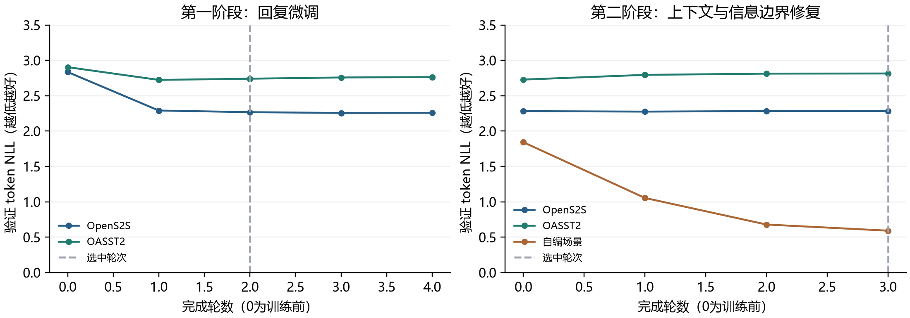
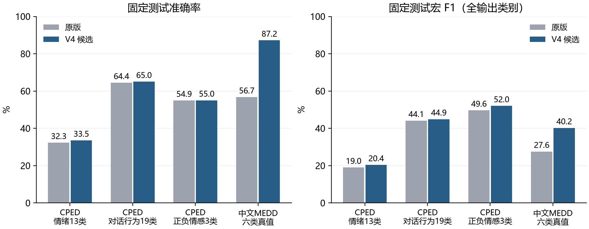
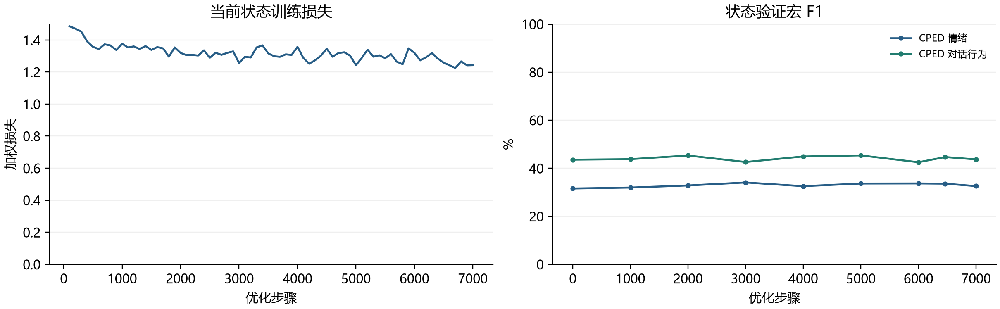

# 中文社会交互模型 V4 训练与交付报告

## 本阶段交付结论

按 2026 年 9 月 26 日的新要求，本阶段聚焦当前情绪识别、对话行为、正负情感与中文多轮回应。未来情绪／行为预测和长期推演退出本阶段发布范围，旧版实验保留。

实际采用的新状态层：当前情绪、对话行为、正负情感。对话：采用本次监督微调的回复适配层。一个 Qwen3.5-2B 底座承载原有任务理解／策略、当前状态与中文回复的任务适配层；没有同时加载多个语言模型。模型已经完成的测试以本报告表格和原始 JSON 为准，不把训练完成等同于所有能力合格。

交付定位是可在本机运行、可接通用 HTTP/JSON 的社会交互组件。它不等于已在家庭现场验收的完整机器人大脑；视觉、语音识别、运动导航和真实设备执行结果仍由外部系统提供。

## 实际训练过程

硬件为 RTX 4060 Laptop 8 GiB、16 GB 内存。底座固定为 Qwen/Qwen3.5-2B 的 15852e8c16360a2fea060d615a32b45270f8a8fc 版本，避免运行中随上游更新改变权重。

当前状态共 95,740 条不同训练样本：93,176 条 CPED 与 2,564 条新增中文情绪样本。外部情绪重复四次，每轮 103,432 次样本曝光；联合更新 LoRA、13 类情绪、19 类对话行为和 3 类情感层。实际完成 7,000 次优化更新、1 个完整轮次，用时 72.0 分钟，峰值分配显存 4.59 GiB。显存为 PyTorch 分配量，不是整机显卡总占用。

状态训练最大长度 256，batch 16；适配层学习率 1e-5，分类层 5e-5，权重衰减 0.03。类别不均衡使用温和类别权重；只根据验证集选择检查点，温度只用验证集拟合。第一步已有非零 LoRA 梯度证据，实际更新了适配参数，而非仅改提示词。

CPED 情绪训练中“中性”有 31,390 条，“感谢”只有 204 条；对话行为中“非观点陈述”40,598 条，“问候”120 条。因此同时报告宏 F1、逐类别结果和训练多数类参照，避免只看总体准确率而忽略稀少类别；这说明数据分布，并非已证明所有错误的原因。

回复训练初筛 1,721 条；进一步抽检发现人工高评分资料也有知识错误和身份污染，因此在第一个训练步骤前收紧为 472 条：408 条 OpenS2S 合成情绪支持文本、16 条逐条审查的 OASST2 样本、48 条项目自编家庭对话目标。每轮通过 1／3／8 次重复形成 840 次曝光。自编内容明确标注合成训练资料，不充当家庭测试证据。

回复训练使用新的 r=8 LoRA，学习率 3e-5，微批次 2，累积 8 次，最大长度 512。只有最终助手回复与结束标记计算损失；系统、用户、历史、填充和隐藏推理全部屏蔽。实际完成 212 次优化更新、1680 个微批次、4 轮，用时 14.1 分钟，峰值分配显存 3.97 GiB。逐段词表投影的损失和梯度已与完整交叉熵作数值对照。

第一轮对话候选虽然降低了参考回复损失，但人工审查发现无图像时虚构衣服外观、未回答前文明确的物品位置，因此拒绝直接发布。随后加强文字输入边界提示，并补充上下文事实、纠正、缺失视觉、设备歧义和只倾听等合成场景。修复训练共 757 条不同记录，包含 285 条新增自编目标和原 472 条训练资料；同一场景的改写放在同一数据集合，完整提示及合成组的跨集合交集均为零。

修复从第一轮选中的适配层继续训练，学习率 2e-5，最大长度 768，微批次 2、累积 8 次，三轮上限；原 OpenS2S／OASST2／家庭目标／新增目标分别重复 1／2／2／3 次，每轮 1,391 次曝光。实际完成 261 次更新、3 轮，用时 19.6 分钟，峰值分配显存 4.01 GiB。选中第 3 轮；依据公开验证损失保留、合成验证损失和验证生成检查选择，没有根据最终测试挑选轮次。两个中止的预检查实验及原因也保留，未用于发布。

## 固定测试结果

下面每格为“准确率 / 宏 F1”。准确率表示标对的样本比例，宏 F1 对每个类别等权平均，能暴露稀少类别表现弱的问题。原版与新候选使用同次执行数据对照；候选未通过的任务不会替换原版。所有情绪分类仍在 13 类输出空间完成，没有把粗粒度情感当成细粒度情绪成绩。

| 固定测试任务 | 原版 | 本次候选 |
|---|---|---|
| CPED 情绪（2398条） | 32.28% / 18.98% | 33.53% / 20.37% |
| CPED 对话行为（2398条） | 64.43% / 44.09% | 65.01% / 44.91% |
| CPED 正负情感（2398条） | 54.92% / 49.65% | 55.00% / 52.02% |
| 中文 MEDD 情绪（312条） | 56.73% / 27.56% | 87.18% / 40.19% |
| 中文 MEDD 正负情感（254条） | 81.89% / 75.53% | 94.49% / 93.70% |

CPED 状态测试 2,398 条来自电视剧话语，曾在此前实验中分析过；中文 MEDD 本次新留出 312 条，来源包含日常、电影及合成内容。MEDD 真实标签覆盖六类，表中宏 F1 仍按全部 13 个输出类别计算；另外的六类宏 F1 见原始评估文件，不能与 13 类数值混报。

按 MEDD 实际出现的六类另算宏 F1，原版为 59.70%，候选为 87.09%；此数值不能直接与 CPED 的 13 类宏 F1 比较。

情绪准确率差值的对话分组自举 95% 区间为 [+0.08, +2.41] 个百分点。 对话行为准确率差值的对话分组自举 95% 区间为 [-0.66, +1.83] 个百分点。 正负情感准确率差值的对话分组自举 95% 区间为 [-1.61, +1.70] 个百分点。CPED 改变量较小，区间跨零的任务不能据此宣称准确率已有确定提高；中文 MEDD 的较大增益也不等于真实家庭成绩。

正负情感是独立的 3 类任务。原版由校准后的情绪概率按 CPED 分组求和，本次候选直接监督学习原始情感标签。该数据中的“惊讶”按 CPED 体系计为负向，不代表一切现实惊讶都是负面。

意图、边界、策略和领域沿用原版适配层及分类权重。运行时实测：切换状态和生成任务再返回后，原版所有分类 logits 逐位相等。此证据证明任务路由没有改坏参数，不是新增意图准确率提升声明。

## 中文回复评估

公开测试集 82 条，包含 73 条合成参考和 9 条 OASST2 人工来源参考；修复阶段另有 35 条按场景隔离的自编测试记录。公开测试已经在第一轮使用过，自编测试与训练共享模板风格，均不应称为独立家庭验收。下表是目标回复每 token 的负对数似然，越低表示更贴近参考措辞，不是用户满意度，也不能证明参考知识正确。底座与修复候选使用完全相同的加强版系统提示，避免把提示词变化计成权重提升。

| 测试来源 | 原底座 NLL | 微调候选 NLL |
|---|---|---|
| 自编场景（35条） | 1.9419 | 0.2848 |
| OASST2 中文（9条） | 2.8637 | 2.8004 |
| OpenS2S 中文（73条） | 2.6954 | 2.2438 |

另有第一轮训练前固定的 24 道开发探针，覆盖情绪倾听、混合情绪、名字／时间纠正、上下文指代、少追问、换话题、缺失视觉、设备未执行及知识问答。修复训练是针对已观察到的失败设计，因此这些题是已知回归测试。人工审查结论：修复候选改善位置取回、设备歧义、视觉缺失说明和倾听要求，在同一加强提示下的总分与上下文分达到预设门槛。但原始生成仍存在：未回答搬家送餐建议、宠物丧失时建议新伙伴替代、混合情绪主体含糊、基础物理解释错误，以及合成测试中一条视觉幻觉。只作为带能力边界和回复约束的社会交互组件发布；不能把裸生成器视为已验收的完整助手。部署另行验证视觉缺失和丧失安慰约束，不改写原始模型分数。项目助手逐题评分为底座 23／48、修复候选 34／48；审查并非盲评或外部用户评价，不换算成“对话准确率”。全部原始回答和逐题理由随交付保留。

生成文本不能授权硬件。常规聊天保留完整会话上下文；设备、低语音识别置信度、请求安静、紧急协助等事件优先经过原控制规则。无实际执行结果时，额外检查明显的“已经打开／发送”等完成声明。该检查只是一层工程约束，不能保证识别所有语义幻觉。

修复后的 35 条合成测试中，简单字符串检查通过 33 条；这不是语义准确率。其中一条“看窗外的花”的回答仍虚构外观，其他个别回答建议使用尚未提供的图像能力。运行接口因此加入明确的缺失图像处理：识别到要求实际看颜色／外观、且不是讨论已给文字描述时，直接说明本接口没有图像。另对丧失倾诉中主动建议用新伙伴替代的已知错误作回复约束。这些属于部署工程修正，原始回答仍保留原分数；不能据此声称模型已学会识图或所有安慰场景都正确。

## 部署与实际运行

GPU 集成检查通过，用时 46.6 秒，峰值分配显存 3.69 GiB。检查包括真实权重重载、任务适配层恢复、中文多轮回应、安静边界、低 ASR 置信度、设备确认、无同意不持久化及删除记忆。设备验证只在模拟控制器上执行，没有操纵真实家庭硬件。

完整服务还重跑了 24 道开发问答。修正了旧路由对高置信“澄清”类别不调用生成的问题，使位置、时间和名字纠正能真正到达用户；未经授权的设备请求可以根据上下文提问，但 task.authorized 仍为 false。未经核实的 CALL_HUMAN 分类仅作为建议，不构成联系他人的授权。实际 HTTP 测试返回了“你说眼镜在卧室的书桌”，并通过连续会话、安静／恢复和设备授权检查。自动测试共 122 项通过。

仍有明确错误：搬家送餐问题有时被回答成先确认是否方便，玻璃杯遇热开裂仍给出不正确的物理解释，部分故事逻辑和生活建议较弱。完整服务逐题记录见 integrated_dialogue_review.json，不能把“接口检查通过”理解为每个回答都正确。

CPU 运行时检查通过，总检查耗时 178.4 秒，但质量等价未通过认定。固定验证探针中，CPU INT8 与 GPU 的情绪标签一致率只有 72.92%（96 条）；对话行为为 84.38%（64 条），正负情感为 83.87%（93 条）。这些是一致率而非正确率。CPU 版仅作为实验兼容入口，不推荐作为本次质量验收配置；未另做 CPU 全量精度与置信度校准。RTX 4060 GPU 服务是推荐入口，报告的公开测试成绩均来自 GPU。

V4 使用独立端口 8767 和独立记忆数据库。根目录 start_v4_gpu.ps1 启动本版，原 V2 启动入口继续保留。Windows 是本机实测环境；Linux 提供同一服务入口与依赖版本记录，未在本机运行 Linux／ARM／BPU 编译验收。

## 负责人需要知道的边界

当前情绪是基于可见中文文本的分类假设，不能保证每次判断正确，更不能推断用户未表达的隐藏心理。关系熟悉度来自交互计数或明确输入，信任值仍为未知；记忆以用户确认身份和同意为条件，不把自动猜测当成个人事实。

本次确实下载、筛选、训练、固定评估并接通运行链路，但公开数据到中国真实家庭仍有分布差异。后续现场验收应重点统计错误安慰、错误指代、反复追问、拒绝未遵从和设备误操作请求；本报告不捏造未采集的家庭测试成绩。

## 证据与来源

关键证据：runs/current_state_lora、runs/dialogue_sft、runs/dialogue_repair_v2 的协议、逐步日志和选择结果；reports/current_state_evaluation.json、dialogue_repair_evaluation.json、dialogue_repair_manual_review.json、runtime_cuda.json、data_audit.json；models/release.json 记录实际启用的参数。第一轮被拒绝的回复模型、审查和中止实验记录保留，便于复核。

模型及研究：[Qwen3.5-2B](https://huggingface.co/Qwen/Qwen3.5-2B)、[CPED](https://github.com/scutcyr/CPED)、[OpenS2S 作者项目](https://github.com/CASIA-LM/OpenS2S)、[OpenS2S 论文](https://arxiv.org/abs/2507.05177)、[OASST2](https://huggingface.co/datasets/OpenAssistant/oasst2)、[中文 MEDD](https://huggingface.co/datasets/Johnson8187/Chinese_Multi-Emotion_Dialogue_Dataset)。这里只使用 OpenS2S 的筛选文本，不宣称复现其语音系统。逐文件版本与哈希、许可声明及改动见数据 manifest 和 THIRD_PARTY_NOTICES.md。
